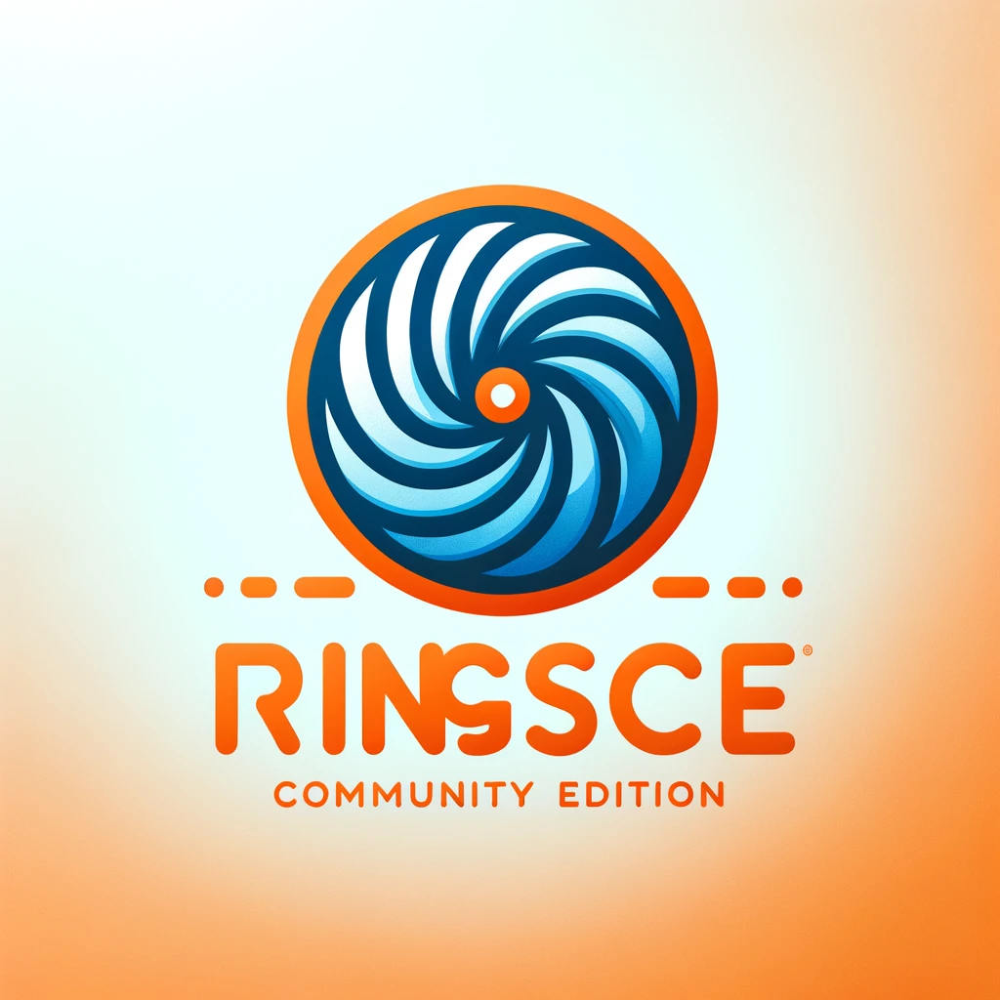

# ringsCE

**ringsCE** is a powerful, hybrid platform that combines open-source and proprietary code to create a flexible and high-performance game development toolset. Compatible with a range of gaming engines, ringsCE is designed to streamline the creation of immersive RPGs, MMOs, and FPS games. ringsCE is optimized for developers using the latest M1+ Apple hardware and integrates with Blender BSP maps for seamless game environment design through the Rings Revolution engine.

## Features

### A Hybrid Approach for Ultimate Flexibility

ringsCE leverages both open-source flexibility and proprietary optimizations. This hybrid approach gives developers access to a dynamic, community-driven core while providing advanced features needed for high-performance gaming applications. The result is a versatile platform that can support complex game interactions and large-scale player environments without compromising speed or stability.

### Key Highlights

- **Cross-Engine Compatibility**: Designed for compatibility with a wide range of gaming engines, ringsCE supports developers creating RPGs, MMOs, and FPS games with the necessary tools and libraries.
  
- **Scalability and Performance**: Optimized for handling large numbers of players and complex in-game interactions, ringsCE ensures reliable and stable performance, especially critical for MMOs and expansive RPGs.

- **Customizable Framework**: ringsCE is built with customization in mind, allowing developers to adapt and extend functionalities to suit unique game requirements, making it ideal for innovative and creative game design.

- **Community and Support**: With a vibrant developer community, ringsCE encourages contributions and feedback. Professional support is also available for troubleshooting and optimizing game development processes.

- **Advanced Development Tools**: Includes a robust scripting engine, debugging tools, and real-time analytics to support efficient development and refinement.

- **M1+ Compatibility**: ringsCE is fully compatible with Apple's M1+ computers, delivering optimized performance on the latest hardware and ensuring developers can work smoothly and efficiently.

- **Blender BSP Maps Compatibility**: ringsCE integrates seamlessly with Blender BSP maps through the **Rings Revolution** engine, allowing developers to design and incorporate custom maps directly from Blender. This compatibility supports complex environment creation and enables designers to import and manage BSP maps without additional conversions.

## Getting Started

1. **Installation**: Clone the ringsCE repository and follow the installation instructions provided in the `INSTALL.md` file.

2. **Compatibility Check**: Verify your development environment meets the requirements, including M1+ support if using Apple hardware.

3. **Setup Blender BSP Maps**: To incorporate Blender BSP maps into your project, export maps from Blender and integrate them through the Rings Revolution engine. See `docs/blender-bsp.md` for detailed setup instructions.

## Documentation

Refer to the `docs` folder for additional information:
- **blender-bsp.md**: Guide for exporting and importing BSP maps from Blender to ringsCE.
- **engine-integration.md**: Instructions for integrating ringsCE with different game engines.

## Community and Support

Join our community to discuss new features, share insights, and contribute to ringsCE’s development:
- **Community Website**: [community.ringsce.com](https://ringscejs.gleentech.com)
- **Support Email**: pdvicente@gleentech.com

---

ringsCE is your complete toolkit for developing the next generation of RPGs, MMOs, and FPS games. Where open source meets proprietary excellence, ringsCE opens endless possibilities in the game development landscape.

